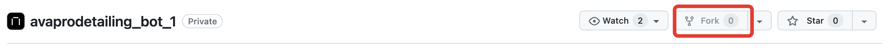

# Бот для детейлинг мастерской AVAPRODETAILING.
## Описание проекта
Бот работает в связке с сервисом на FastAPI.

Основная функция сервиса - привлечение клиентов в сервис предприятия, путем развертывавания системы лояльности на платформе популярного мессенджера - Telegram.

Пользователь регистрируется в системе и получает 100 приветственных баллов. Может добавлять и удалять свой автотранспорт.

Администрирование так же осуществляется через мессенджер. Администратор может производить поиск, регистрацию, редактирование свойств клиента. Начислять бонусы лояльности за оплату услуг. Используется прием онлайн оплаты счетов.
## Стэк технологий


## Инструкция по сборке и запуску
### Клонирование репозитория
Скопируйте репозиторий в свой аккаунт GitHub, нажав кнопку **Fork**.

**Настройка:**

Перейдите в раздел *Settings* -> *Secrets and Variables* -> *Actions* в вашем репозитории.

Добавьте следующие секреты:

* **DOCKER_USERNAME** и **DOCKER_PASSWORD** - ваши учетные данные с Docker Hub.

* **HOST** - IP адрес вашего сервера, где будет развернуто приложение.
* **USER** - имя пользователя на сервере.
* **SSH_KEY** - приватный SSH ключ для подключения к серверу.
* **PASSPHRASE** - пароль для вашего SSH ключа.

**Корректировка конфигурации:**

Отредактируйте файл infra/docker-compose.yaml, указав ваш аккаунт в Docker Hub в качестве префикса для image.

### Подготовка сервера
#### Установка Docker
Ниже рассматривается установка Docker на Ubuntu версии 20.04 и выше.


Создайте файл .env в корневой директории проекта, используя файл env.example в качестве шаблона.

```
BOT_TOKEN = <bot_id>
BOT_URL=<telegram_bot_url_link>
SHOP_ID=<shop_id_yookassa>
SHOP_TOKEN=<api_token_yookassa>

# connection string for sqlite
SQLITE_DATABASE_URL = sqlite+aiosqlite:///./<name>
# string for test/prod service mode
TEST_MODE = True

PGADMIN_DEFAULT_EMAIL=admin@example.com
PGADMIN_DEFAULT_PASSWORD=admin

# strings for postgresql connection
POSTGRES_PASSWORD=password
POSTGRES_USER=username
POSTGRES_DB=database
POSTGRES_HOST=db

SITE_URL=https://ava-detailing.ru:8081
WEBHOOK_HOST=<webhook_host>
BASE_WEBHOOK_URL=<base_webhook_url>
WEBHOOK_SECRET=webhook_secret
WEB_SERVER_PORT=8081
WEB_SERVER_HOST=https://ava-detailing.ru
```

## Команда
1. Балашов Валерий [GitHub](https://github.com/elValeron)
2. Корняков Никита [GitHub](https://github.com/nonamebroski)
3. Ламберт Елена [GitHub](https://github.com/ElenaL1)
4. Гугуцидзе Валерий [GitHub](https://github.com/gugutsidze-vv)


3. Инструкция по сборке и запуску
4. 
5. Ссылки на сторонние фреймворки, библиотеки, иконки и шрифты если использовались.