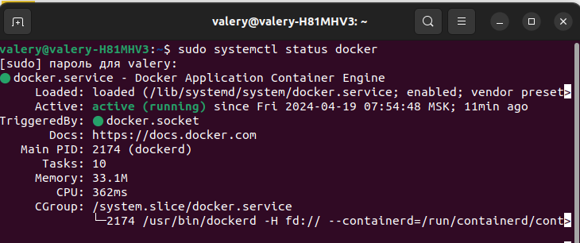

# Бот для детейлинг мастерской AVAPRODETAILING.
## Описание проекта
Бот работает в связке с сервисом на FastAPI.

Основная функция сервиса - привлечение клиентов в сервис предприятия, путем развертывавания системы лояльности на платформе популярного мессенджера - Telegram.

Пользователь регистрируется в системе и получает 100 приветственных баллов. Может добавлять и удалять свой автотранспорт.

Администрирование так же осуществляется через мессенджер. Администратор может производить поиск, регистрацию, редактирование свойств клиента. Начислять бонусы лояльности за оплату услуг. Используется прием онлайн оплаты счетов.
## Стэк технологий


## Инструкция по сборке и запуску
### Клонирование репозитория
Скопируйте репозиторий в свой аккаунт GitHub, нажав кнопку **Fork**.

**Настройка:**

Перейдите в раздел *Settings* -> *Secrets and Variables* -> *Actions* в вашем репозитории.

Добавьте следующие секреты:

* **DOCKER_USERNAME** и **DOCKER_PASSWORD** - ваши учетные данные с Docker Hub.

* **HOST** - IP адрес вашего сервера, где будет развернуто приложение.
* **USER** - имя пользователя на сервере.
* **SSH_KEY** - приватный SSH ключ для подключения к серверу.
* **PASSPHRASE** - пароль для вашего SSH ключа.

**Корректировка конфигурации:**

Отредактируйте файл infra/docker-compose.yaml, указав ваш аккаунт в Docker Hub в качестве префикса для image.

### Подготовка сервера
#### Установка Docker
Ниже рассматривается установка Docker на Ubuntu версии 20.04 и выше.
* Если у вас не установлен **curl**, то выполните следующие команды:
```
sudo apt update
sudo apt install curl
```
* Далее выполните последовательно оставшиеся команды:
```
curl -fSL https://get.docker.com -o get-docker.sh 
sudo sh ./get-docker.sh
sudo apt install docker-compose-plugin 
sudo systemctl status docker
```
После последней команды у вас в терминале должекн быть примерно такой вывод:


Создайте файл .env в корневой директории проекта, используя файл env.example в качестве шаблона.

```
BOT_TOKEN = <bot_id>
BOT_URL=<telegram_bot_url_link>
SHOP_ID=<shop_id_yookassa>
SHOP_TOKEN=<api_token_yookassa>

# connection string for sqlite
SQLITE_DATABASE_URL = sqlite+aiosqlite:///./<name>
# string for test/prod service mode
TEST_MODE = False

PGADMIN_DEFAULT_EMAIL=admin@example.com
PGADMIN_DEFAULT_PASSWORD=admin

# strings for postgresql connection
POSTGRES_PASSWORD=password
POSTGRES_USER=username
POSTGRES_DB=database
POSTGRES_HOST=db

SITE_URL=<имя домена>

WEBHOOK_SECRET=webhook_secret
WEB_SERVER_PORT=8080
WEB_SERVER_HOST=127.0.0.1
```
Скопируйте следующие файлы на ваш сервер в директорию, где будет храниться ваш проект:

* infra/docker-compose.yaml
* infra/nginx.conf (в директорию nginx)
* .env

Это можно сделать через Панель управления сервером, если таковая имеется или через терминал командой:
```
scp /home/test.txt root@123.123.123.123:/directory
```
Файл test.txt будет скопирован на хост 123.123.123.123 в директорию «/directory».

Если у вас ОС Windws, то используйте ПО [Putty](https://www.putty.org/) и команду pscp

### Запуск проекта:

После переноса файлов на сервер проект будет автоматически запущен при отправке (push) изменений в вашем репозитории на GitHub. или вы можете запустить его командой в ssh сессим подключения в терминале в директории проекта:
```
sudo docker compose -f docker-compose.yml up -d
```
Остановить можно вручную
```
sudo docker compose -f docker-compose.yml down
```
### Использование PGAdmin
Для доступа к таблицам бд на 8088 порту через веб-интерфейс можно получить длоступ к веб-интерфейсу для просмотра и редактирования БД. Так же при знании языка SQL можно подготовить запросы для дополнительных отчетов, которые не учтены в проекте.
доступ по почте и паролю из .env файла
```
PGADMIN_DEFAULT_EMAIL=admin@example.com
PGADMIN_DEFAULT_PASSWORD=admin
```
## Документация используемых библиотек
Aiogram [Документация](https://docs.aiogram.dev/en/latest/)

Fast Api [Документация](https://fastapi.tiangolo.com/)

Pydantic [Документация](https://docs.pydantic.dev/latest/)

Pydantic-settings [Документация](https://pydantic-settings.readthedocs.io/en/latest/)

qrcode [Документация](https://github.com/lincolnloop/python-qrcode)

Telegram Mini Apps [Документация](https://core.telegram.org/bots/webapps)

Docker [Документация](https://docs.docker.com/)

Alembic [Документация](https://alembic.sqlalchemy.org/en/latest/index.html)

SQLALchemy [Документация](https://www.sqlalchemy.org/)

## Команда
1. Балашов Валерий [GitHub](https://github.com/elValeron)
2. Корняков Никита [GitHub](https://github.com/nonamebroski)
3. Ламберт Елена [GitHub](https://github.com/ElenaL1)
4. Гугуцидзе Валерий [GitHub](https://github.com/gugutsidze-vv)
